# Hi there, I'm Naeem Musamh 🙋‍♂️

Previously I studying accounting, but now I am studying web developer, I find it so interesting to learn it and it will help me in my business field like accounting and create a program the market his want and make some people live easy.

 
 
 

<h2> Project </h2> 

<li> Medicine &nbsp;&nbsp; <a href='https://ibn-sina.github.io/medicine/'> web page</a></li>
<li> chaTech &nbsp;&nbsp; <a href='https://chatech.herokuapp.com/'> web page</a></li>
<li> Super-Nova &nbsp;&nbsp; <a href="https://eraser-app.netlify.app/"> web page </a> </li>

 
 
 

 
 
 

&nbsp;   &nbsp;   

 
 
 

## Technological

Programming Languages
-----------------------
------------------------

Frameworks, Platforms and Libraries
-----------------------
-----------------------

Editors
---------------------
---------------------

Version Control
----------------------
----------------------

Education
-----------------
------------------

Hosting
---------------
---------------

Databases
----------------------
----------------------

Cloud Storage
-------------------
-------------------

Office
------------------
------------------

Other
-----------------------
-----------------------

Operating System
-----------------------
-----------------------

 
 
 

## Contact me

